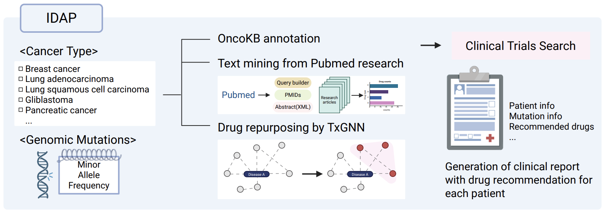

# Readme

# Introduction

IDAP presents a hybrid framework that integrates curated clinical knowledge, graph-based inference, and real-time literature mining to support precision drug recommendations and clinical decision-making for cancer patients.

The pipeline takes a MAF file as input and consists of three core modules:

- **OncoKB** – Provides FDA-approved therapeutic options based on clinically actionable variants.
- **PubMed Mining** – Performs real-time evidence retrieval from PubMed to identify drugs mentioned in studies relevant to the patient’s mutations and cancer type.
- **TxGNN** – Utilizes the knowledge graph from the TxGNN drug-repurposing framework to recommend graph-inferred candidate drugs associated with the disease and mutated genes.

Together, these modules enable an integrated, multi-source approach for variant-driven therapeutic prioritization.



# Run

### Preparation

1. **Clone this repository**

```bash
git clone https://github.com/yebiniii/IDAP-pipeline.git
```

**2. Clone required external modules (OncoKB Annotator & TxGNN)**

This pipeline depends on both OncoKB Annotator and TxGNN, so they must be cloned inside the IDAP-pipeline directory.

```bash
# oncokb annotator
git clone https://github.com/oncokb/oncokb-annotator.git

# txgnn
git clone https://github.com/mims-harvard/TxGNN.git
```

**3. Obtain API keys (OncoKB and PubMed)**

Both APIs are required to execute the pipeline:

**OncoKB**

You must apply for an API license. A brief research description is required.

🔗 https://www.oncokb.org/api-access

**PubMed**

Log in to NCBI, open Account Settings, and generate your API Key. No special approval process is required.

🔗 https://pubmed.ncbi.nlm.nih.gov/

### Run the pipeline

**Command-line Usage**

```python
usage: main_pipeline.py [-h] --maf MAF --cancer CANCER --oncokb_token ONCOKB_TOKEN --annotator ANNOTATOR 
                        --txgnn_data TXGNN_DATA --txgnn_root TXGNN_ROOT [--pubmed_token PUBMED_TOKEN]
                        [--outdir OUTDIR] [--patient_id PATIENT_ID]

optional arguments:
  -h, --help                Show help message and exit
  --maf MAF                 Input MAF file
  --cancer CANCER           Cancer type (e.g., NSCLC, breast cancer)
  --oncokb_token ONCOKB_TOKEN
                            OncoKB API token
  --annotator ANNOTATOR     Path to MafAnnotator.py
  --pubmed_token PUBMED_TOKEN
                            PubMed API key
  --txgnn_data TXGNN_DATA   Path to TxGNN data folder
  --txgnn_root TXGNN_ROOT   Path to TxGNN root folder
  --outdir OUTDIR           Output directory
  --patient_id PATIENT_ID   Optional patient identifier
```

**Example Execution**

```python
pwd  # ~/IDAP-pipeline

python main_pipeline.py \
    --maf ./data/test_NSCLC.maf \
    --cancer "lung cancer" \
    --oncokb_token <your_oncokb_token> \
    --annotator ./oncokb-annotator/MafAnnotator.py \
    --pubmed_token <your_pubmed_token> \
    --txgnn_data ./TxGNN/data \
    --txgnn_root ./TxGNN \
    --outdir ./test
```